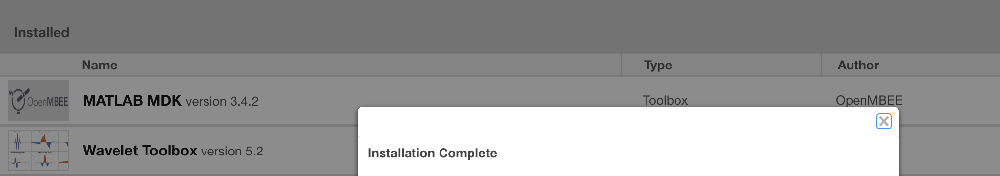
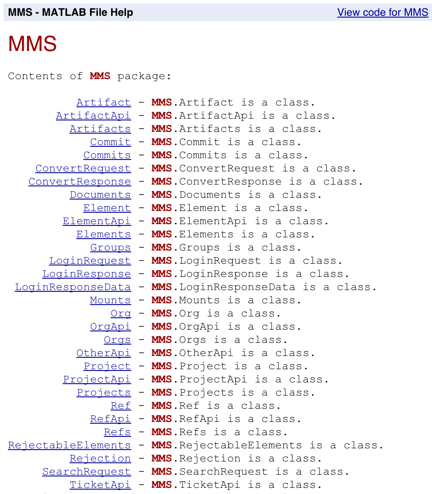

# MATLAB MDK

MATLAB MDK is a toolbox for [MATLAB](https://www.mathworks.com/products/matlab.html) that enables interactions with the [MMS](https://github.com/Open-MBEE/mms-alfresco) such as retrieving analysis inputs and publishing analysis outputs, e.g. computed values, plots, tables.

# Quickstart

# Prerequisites

* [MATLAB](https://www.mathworks.com/products/matlab.html)
* [Model Management System (MMS) 3](https://github.com/Open-MBEE/mms-alfresco)

## Installation

1.  [Download](https://bintray.com/openmbee/maven/matlab-mdk/_latestVersion) the MATLAB MDK toolbox, e.g. `matlab-mdk-*.mltbx`.

2.  Double-click (or right click > "Open With" > "MATLAB", as applicable) the downloaded `matlab-mdk-*.mltbx` file. See [MATLAB documentation](https://www.mathworks.com/help/matlab/matlab_env/get-add-ons.html#buytlxo-3) for more info. MATLAB should prompt with the following window.

    

3.  Return to the MATLAB main window and in the Command Window run `doc(MMS)` to test the installation.

    Example output:

    

4.  Check out the [example functions](examples).

>   MATLAB MDK can also be installed headlessly using [`matlab.addons.install`](https://www.mathworks.com/help/matlab/ref/matlab.addons.install.html).

# Local Development

* Run `build.sh` to generate matlab-mdk build directory.
* Run the MATLAB Toolbox Packager from main menu "Home" > "Environment" ribbon > "Add-Ons" > "Package Toolbox" > "Open Project" > [`matlab-mdk.prj`](matlab-mdk.prj). See [MATLAB documentation](https://www.mathworks.com/help/matlab/matlab_prog/create-and-share-custom-matlab-toolboxes.html#buf2ahi-3) for more info.
* Follow the [Installation](#Installation) instructions.